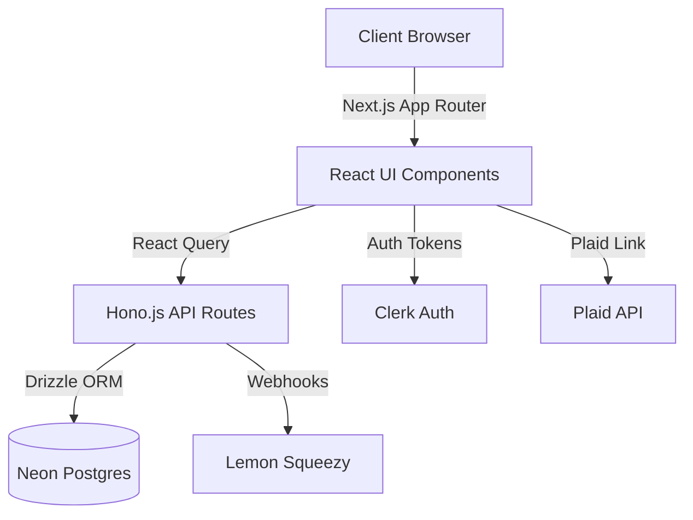

<!-- BEGIN:nextjs-agent-rules -->
# This is NOT the Next.js you know

This version has breaking changes — APIs, conventions, and file structure may all differ from your training data. Read the relevant guide in `node_modules/next/dist/docs/` before writing any code. Heed deprecation notices.
<!-- END:nextjs-agent-rules -->

# Project Overview
Finance is a modern, responsive, and full-featured personal finance management platform built with Next.js 16, Hono.js, Drizzle ORM, and Tailwind CSS. It enables users to track income and expenses, connect bank accounts securely via Plaid, manage premium features via Lemon Squeezy subscriptions, and view interactive insights through Recharts-powered dashboards.

## Repository Structure
- `app/` – Next.js App Router entry points, layouts, metadata (SEO), and page components.
- `components/` – Shared UI components (built with shadcn/ui and Radix UI) and general visual elements.
- `db/` – Drizzle ORM schema definitions and database connection utilities for Neon Serverless Postgres.
- `drizzle/` – Generated SQL migration files and Drizzle kit artifacts.
- `features/` – Domain-driven feature modules (accounts, categories, plaid, subscriptions, summary, transactions) containing specialized hooks and logic.
- `hooks/` – Custom global React hooks for shared behaviors.
- `lib/` – Shared application utilities, Hono RPC client setup, and helper functions (e.g., date formatting).
- `providers/` – Global React context providers (e.g., Clerk Auth, React Query, Theme).
- `public/` – Static assets like icons and images.
- `scripts/` – Database execution scripts for migrations and seeding.

## Build & Development Commands
```bash
# Install dependencies
bun install

# Start local development server
bun run dev

# Build for production
bun run build

# Start production server
bun run start

# Lint the codebase
bun run lint
bun run lint:fix

# Generate database migrations
bun run db:generate

# Apply database migrations
bun run db:migrate

# Seed the database
bun run db:seed

# Open Drizzle Studio for database management
bun run db:studio
```

## Code Style & Conventions
- **Formatting & Linting:** Uses ESLint configured with custom rules for import sorting (`simple-import-sort`) and React JSX prop sorting.
- **Language:** TypeScript 5 is strictly used for all logic, components, and APIs.
- **Styling:** Tailwind CSS v4, managed with `cn()` utility (`clsx` + `tailwind-merge`) and `class-variance-authority` for variants.
- **Imports:** Structured import sorting (React/Next first, external packages, internal aliases `@/*`, relative imports).
- **Commit Messages:** > TODO: Define conventional commit guidelines (e.g., feat, fix, chore) for version control.

## Architecture Notes

The application relies on Next.js for SSR and React components, with specialized domain logic encapsulating API calls residing in `features/`. The backend is a serverless edge API built with Hono.js, which interacts with a Neon Serverless Postgres database using Drizzle ORM. External integrations like Plaid, Lemon Squeezy, and Clerk communicate with both the client UI and the secure server environment to manage authentication, banking data, and premium access layers.

## Testing Strategy
> TODO: Setup and configure a formal testing framework (e.g., Vitest or Jest) for unit testing and Playwright/Cypress for E2E tests. Currently, no formal testing scripts are defined in the build configuration.

## Security & Compliance
- **Secrets Handling:** Uses environment variables (`.env.local`) for sensitive credentials. Next.js handles hiding server-only secrets from the client.
- **Authentication:** Clerk manages user sessions, registration, and identity. Hono middleware validates Clerk tokens (`@hono/clerk-auth`) before accessing protected RPC endpoints.
- **Database Access:** Drizzle ORM provides a secure abstraction to prevent SQL injection vulnerabilities.
- **Guardrails:** Sensitive financial credentials (Plaid tokens, Lemon Squeezy webhook secrets) must never be logged or exposed to client-side code.

## Agent Guardrails
- **Read-Only Code:** Do not modify the generated files in the `drizzle/` directory; use `bun run db:generate` to produce migrations.
- **Environment Settings:** Never commit `.env.local` or raw API keys to source control.
- **Style Enforcement:** Ensure any new components respect the existing `eslint.config.mjs` import sorting and JSX ordering rules.
- **State Management:** When dealing with remote state, prefer `@tanstack/react-query` hooks located inside `features/*/api/` over local component state.

## Extensibility Hooks
- **Feature Flags:** > TODO: Add explicit feature flagging tools (e.g., LaunchDarkly, Vercel Edge Config) if needed for gradual rollouts.
- **Webhooks:** The `api/` endpoints (specifically for Lemon Squeezy) act as the central hook for external state synchronization.
- **Plugins/Integrations:** Plaid and Lemon Squeezy integration points can be horizontally expanded in their respective `features/` domain directories.

## Further Reading
- [Next.js Documentation](https://nextjs.org/docs)
- [Hono.js Documentation](https://hono.dev/)
- [Drizzle ORM Documentation](https://orm.drizzle.team/)
- > TODO: Link to specific `docs/ARCH.md` or ADRs once created.
